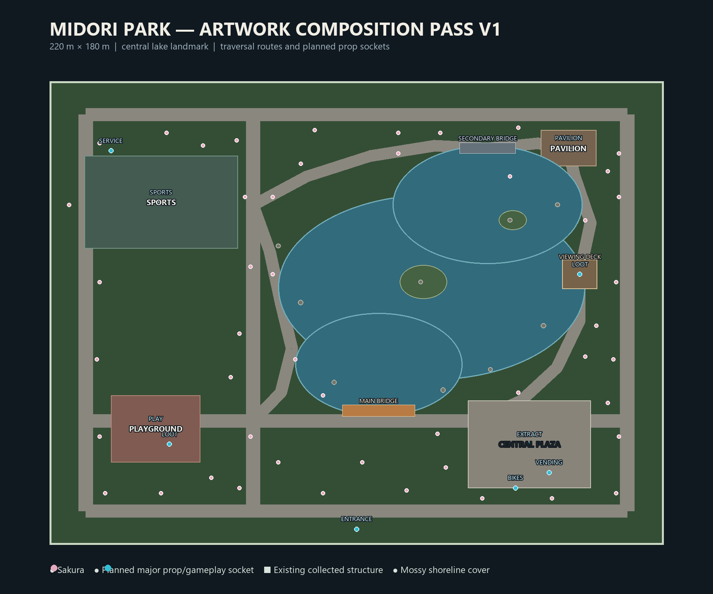

# Midori Park artwork composition plan

The active scene is a 220 m × 180 m landmark park based on the supplied SHINRAI CITY artwork. The layout keeps the artwork's large central lake, dense sakura canopy, activity zones, and open gathering areas while adding multiple traversal choices for the extraction-shooter loop.

## Current implemented composition

- Central irregular lake built from three overlapping lobes, with two planted islands.
- Main arched timber-and-metal bridge at the south lake approach.
- Secondary industrial footbridge across the north lobe.
- Eastern lakeside viewing deck with a planned loot socket.
- Curved west, north, and east promenades connect the grid paths to the lake districts.
- Nine mossy boulder groups around the shoreline, used as cover and recognizable navigation points.
- Thirty-six fountain-grass and meadow-grass clusters around the water edge.
- Twenty-four sakura accents, dense mainland tree groves, four irregular five-tree edge groves, and clustered lilac understory, with the main routes kept readable. Each new edge grove uses one skinny pine and preserves at least 3 m between trunks.
- Twenty-four knee-height grass patches from the existing grass pack break up the mainland grove floors; the 18,000 near-ground clumps remain a separate low layer.
- Lilac understory is grouped into irregular 3–7 plant pockets instead of isolated rows, with approximately 1.3 m of clean shoulder beside important paths.
- Mainland deadwood uses seven varied fallen beech-trunk placements, five upright stump bases, and one heavy hollow-bark focal prop. Four large logs, three tall stumps, and the hollow piece have simple gameplay collision.
- Twenty-five light fountain/meadow grass accents form irregular mainland transition pockets around grove floors; the 18,000 near-ground clumps and four heavy grass accents remain unchanged.
- Fourteen young pines use three dedicated sapling meshes to break the mature-tree rhythm on the mainland. They share the skinny-tree spacing rules and have no collision.
- Fifty-six low broadleaf woodland bushes form irregular five-plant floor pockets around mainland groves. The lawn uses a deeper green value, and all 196 generated mainland tree visuals are settled 3.5 cm into the terrain.
- Two Japanese maple accents remain planned but unplaced until a genuine maple asset is supplied; the existing ash/oak-like broadleaf pack is not relabelled as maple.
- Sports district west, playground southwest, central plaza southeast, and pavilion overlook northeast.
- Main arrival from the south with secondary entrances on the north, east, and west edges.

## Traversal and combat routes

1. **South arrival to plaza:** the safest readable route, with broad sightlines and future planters for waist-high cover.
2. **South arrival to main bridge:** the fastest route toward the lake islands and eastern overlook.
3. **West activity route:** runs past playground and sports courts, using trees and future furniture for short cover intervals.
4. **North bridge route:** a tighter alternative around the north lake lobe toward the pavilion.
5. **Perimeter loop:** supports flanking and extraction rotation while remaining inside the 120–130 m fog envelope.

The bridge meshes remain provisional. Their final spans will be lengthened during the last structure-fitting pass after the shore and path widths are locked.

## Planned prop sockets

Every entry below exists as a named `Marker3D` under `PlannedPropSockets` in the running scene. The markers are hidden during normal play.

### Architecture

- `ARC01_Pavilion` — northeast overlook, facing the lake.
- `ARC02_MaintenanceRestroom` — northwest service edge beside the sports district.
- `ARC03_MainEntranceMarker` — south entrance focal point.

### Activities

- `ACT01_PlaygroundSet` — southwest activity lawn.
- `ACT02_BasketballHoopWest` and `ACT02_BasketballHoopEast` — opposing ends of the sports court.
- `ACT03_TennisNet` — centre of the sports court.

### Furniture and services

- Nine `FUR01_Bench_*` sockets distributed along the lake, cross-path, and perimeter loop.
- Twelve `FUR04_PathLamp_*` sockets at path intersections and darker edge routes.
- `FUR06_MainInformationBoard` at the south arrival.
- `FUR08_DrinkingFountain` between the playground and plaza route.
- `FUR09_BicycleRack` and `FUR10_VendingMachine` on the plaza edge.
- `FUR13_EmergencyPoint` on the eastern loop.

### Gameplay and cover

- Two `GAM01_PlazaPlanter*` sockets create cover across the open plaza.
- `GAM03_UtilityCabinet` creates service-area cover near the northwest building.
- `GAM04_SecurityCamera` watches the plaza/east-loop junction.
- Loot sockets are reserved at the pavilion, playground, and viewing deck.
- The central plaza contains the first extraction/event socket.

## Next asset placement order

1. Green tree variants around the perimeter, sports edge, and northern buffer.
2. Pavilion, maintenance/restroom building, and main entrance marker.
3. Benches, lamps, information board, rubbish stations, fountain, bicycle rack, and vending machine.
4. Playground and sports equipment.
5. Planters, barriers, utility cabinets, cameras, and other combat-cover props.
6. Fallen petals, damp patches, moss edges, litter, water effects, and local ambience.
